[JAVASCRIPT__BADGE]: https://img.shields.io/badge/Javascript-000?style=for-the-badge&logo=javascript
[HTML__BADGE]: https://img.shields.io/badge/html5-%23E34F26.svg?style=for-the-badge&logo=html5&logoColor=white 
[CSS__BADGE]: https://img.shields.io/badge/css3-%231572B6.svg?style=for-the-badge&logo=css3&logoColor=white
[MIT__BADGE]: https://img.shields.io/github/license/Naereen/StrapDown.js.svg

<h1 align="center" style="font-weight: bold;">🖱️ TechCare</h1>

![html][HTML__BADGE]
![css3][CSS__BADGE]
![javascript][JAVASCRIPT__BADGE]
![mit][MIT__BADGE]

  <a href="#sobre">Sobre</a> • 
  <a href="#acesso">Acesse Aqui</a> • 
  <a href="#design">Design</a> •
  <a href="#mobile">Mobile</a> •
  <a href="#funcionalidades">Funcionalidades</a> • 
  <a href="#fontes">Fontes</a> •
  <a href="#licenca">Licença</a>

 

    

 

<h2 id="sobre">📌 Sobre</h2>

Uma landing page de uma empresa de manutenção de computadores, chamada TechCare. Este site possui um <ins>Tema Escuro e Claro</ins> e <ins>dois idiomas</ins>, <ins>Português Brasileiro e Inglês</ins>, ambos são definidos a partir das <ins>preferências do usuário</ins>, e também, podem ser alternados. O projeto foi realizado com <strong>HTML</strong>, <strong>CSS</strong> e <strong>Javascript</strong>, utilizando a prática <strong>Mobile First</strong> e versionamento <strong>Git</strong>.

 
 

<h2 id="acesso">🚀 Acesse o Projeto</h2>

Veja o projeto você mesmo: <a href="https://joaovitordomingos.github.io/TechCare/" target="_blank">TechCare</a>

 
 

<h2 id="design">🎨 Design</h2>

O desing do site foi feito por mim. Foi utilizado o <strong>Figma</strong> para realização do desing.

Segue o link do projeto no figma: <a href="https://www.figma.com/design/b8TuckdaemvDhMGGeMRBIi/TechCare?node-id=0-1&t=yKTBIiJv09XAm28Q-1">LINK FIGMA</a>

<strong>Senha:</strong> TechCare

<strong>OBS: </strong>Por favor, <ins>não adicionar comentários!</ins>

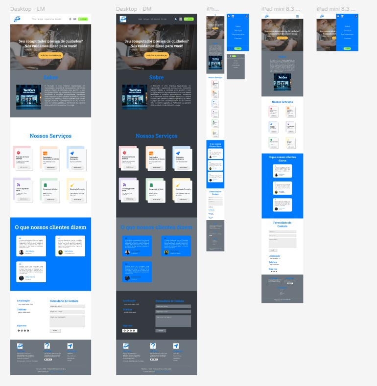

 
 

<h2 id="mobile">📱 Mobile</h2>

O site foi feito com a prática <strong>Mobile First</strong>, sendo realizado primeiro para as telas menores (celulares) e depois expandido para telas maiores.

A maior diferença no desing para os diferentes tamanhos de telas está no menu, onde em telas menores, de celulares, o menu é um simples menu hamburguer que se expande para a tela toda ao clicado. Para telas médias, tablets, há a logo da empresa na direita e o menu hamburguer na esquerda, expandindo para metada da tela. Agora em telas maiores, o menu é completo.

<strong>Telas Menores:</strong>

    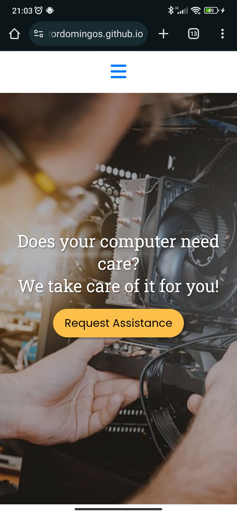
    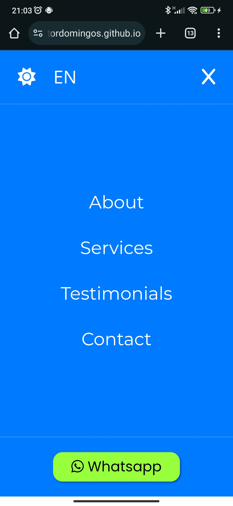

 

<strong>Telas Médias:</strong>

    
    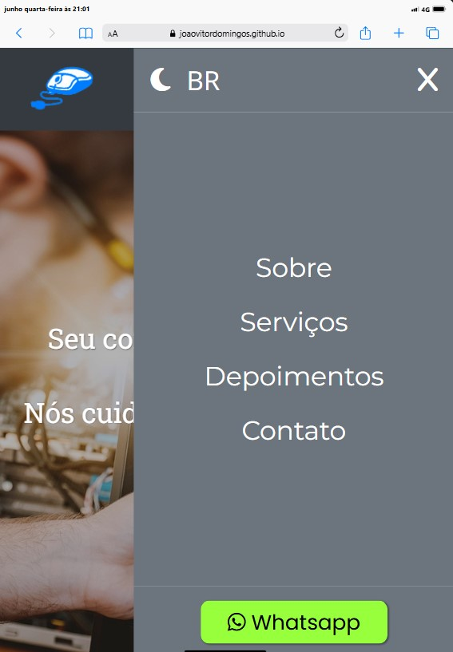

 

<strong>Telas Maiores:</strong>

    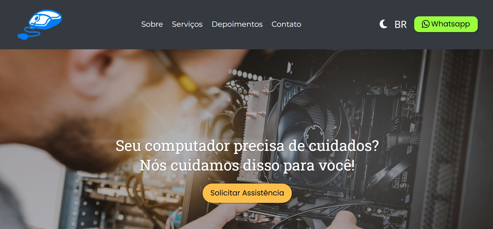

 
 

<h2 id="funcionalidades">💻 Funcionalidades</h2>

Nesta sessão, falarei sobre o JavaScript, detalhando o que faz e como foi implementado.

  
<h3>Sumário</h3>

  <ol>
    <li><a href="#menu">Ajustes no menu expandido</a></li>
    <li><a href="#dark">Dark Mode</a></li>
    <li><a href="#idioma">Troca de idioma</a></li>
  </ol>

<h3 id="menu">Ajustes no menu expandido</h3>
<h4>Scroll com Menu Expandido</h4>

A funcionalidade do menu é puramente CSS, não foi feito nada em Javascript. Há um checkbox, com display none. que quando se clica no menu hamburguer, que está dentro de uma label, o checkbox se ativa, assim expandindo a uma div, chamada menu expandido, que, pelo nome, é o menu expandido, ocupando toda a tela com o atributo <code>position</code> em <code>fixed</code>.

Porém, isto gera um problema, quando se expande o menu, ainda é possível rolar a página do site, algo que não deveria ser possível. Então para prevenir este comportamento, foi criado uma classe chamada <code>no-scroll</code> que é aplicada via Javascript no body sempre que o menu se expande e é retirada quando ele se fecha. Esta classe impede que o usuário role a tela quando o menu se expandir.

Este ajuste foi feito apenas para as telas menores, já que o menu expandido ocupa a tela toda. Agora em telas médias, o menu apenas ocupa metade da tela, assim sendo, não tem o porquê bloquer o scroll. E em telas maiores, o menu expandido não está presente.

    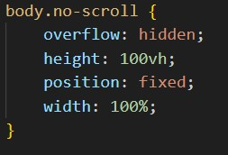
    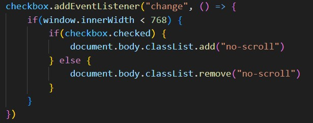

 
<h4>Link não fechando o Menu Expandido</h4>

Outro problema presente era quando se clicava nos links que estavam no menu expandido. O desejável era que quando clicasse em algum link, o menu fechasse e o usuário fosse redirecionado para o local do link, entretanto isto não acontecia.

Portanto, via Javascript, é forçado o menu a se fechar. No qual, se desmarca o checkbox e dispara um evento de <code>change</code>, assim chamando a função que coloca ou retira a classe <code>no-scroll</code> do <code>body</code>, para que destrave o scroll da página.

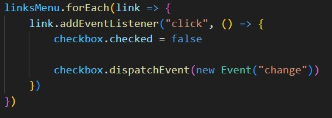

 
 

<h3 id="dark">Dark Mode</h3>

O site possui um Tema Light e um Tema Dark, no qual um deles é definido a partir da preferência do usuário quando a página é carregada, e salvo em <ins>Local Storage</ins> para que sempre que o usuário voltar, esteja como ele deixou.

Há um botão no menu que troca os tema, onde o ícone de sol representa o Light Mode e o ícone da lua representa o Dark Mode. Sempre que é alterado o tema, é salvo em <ins>Local Storage</ins>.

O site foi desenvolvido no Tema Light, e o Tema Dark é uma classe, chamada <code>dark-mode</code>, que é adicionada ao body, toda a estilização do Tema Dark está em arquivo CSS separado.

 
 

<h3 id="idioma">Troca de idioma</h3>

Há dois idiomas no site, Português Brasileiro e Inglês, no qual é definido também a partir das preferências do usuário, caso o idioma de preferência seja o pt-br, então o site ficará neste idioma, agora, caso não seja, é alterado para inglês. Também é salvado em <ins><ins>Local Storage</ins></ins> o idioma e é possível alterar, clicando no botão no menu.

Todos os textos, tanto em pt-br quanto em inglês, estão em um arquivo <code>.json</code>, um arquivo para pt-br e outro para inglês. O <code>.json</code> foi estruturado de uma forma que ficasse fácil a navegação para obter o texto.

Todos os elementos, que possuem texto, tinham dois <code>data-</code> atributos, <code>data-langPath</code> e <code>data-lang</code>, no qual dizia o caminho que precisava percorrer no <code>.json</code> para obter o seguinte texto na linguagem escolhida.

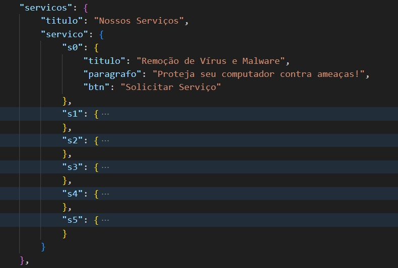

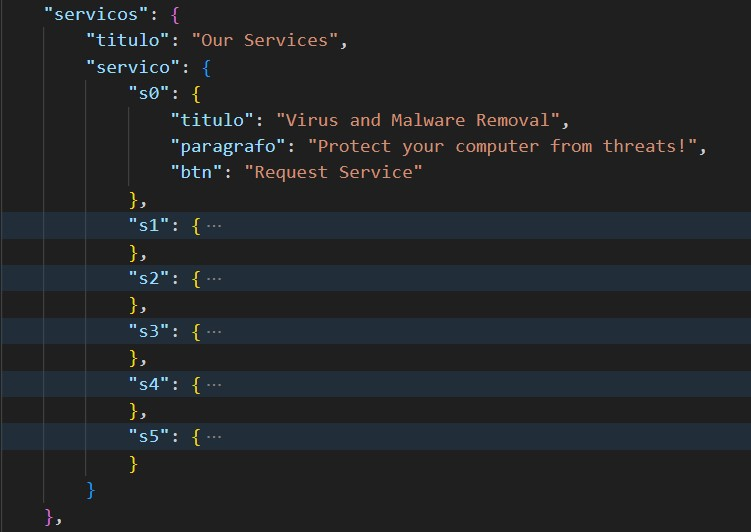

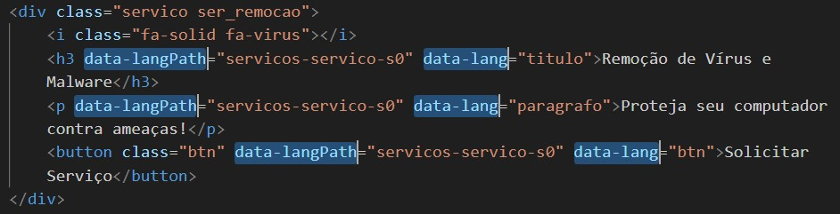

 
 

<h2 id="fontes">📚 Fontes & Créditos</h2>

Tanto a logo da loja quanto a foto que mostra a loja foram feitas por Inteligência Artificial. A logo foi criada pela IA <a href="https://manage.wix.com/logo/maker/esh">Wix Logo Maker</a> e feito algumas edições no <ins>PhotoShop</ins> para finalizar a logo. Já a imagem foi gerada pela IA <a href="https://leonardo.ai/">Leonardo</a>.

As outras imagens do site foram obtidas através do banco de dados gratuito <a href="https://www.pexels.com/pt-br/">Pexels</a>.

Todos os ícones presentes no site são do <a href="https://fontawesome.com/icons">FontAwesome</a>, são todos gratuitos.

E as fontes do site são do <a href="https://fonts.google.com/">Google Fonts</a>, sendo elas: 

<ul>
  <li>Roboto Slab
  <li>Open Sans
  <li>Poppins
  <li>Montserrat
</ul>

 
 

<h2 id="licenca">📃 Licença</h2>
Veja a lincença do projeto: <a href="https://github.com/JoaoVitorDomingos/TechCare?tab=MIT-1-ov-file">MIT License</a>

 
 
